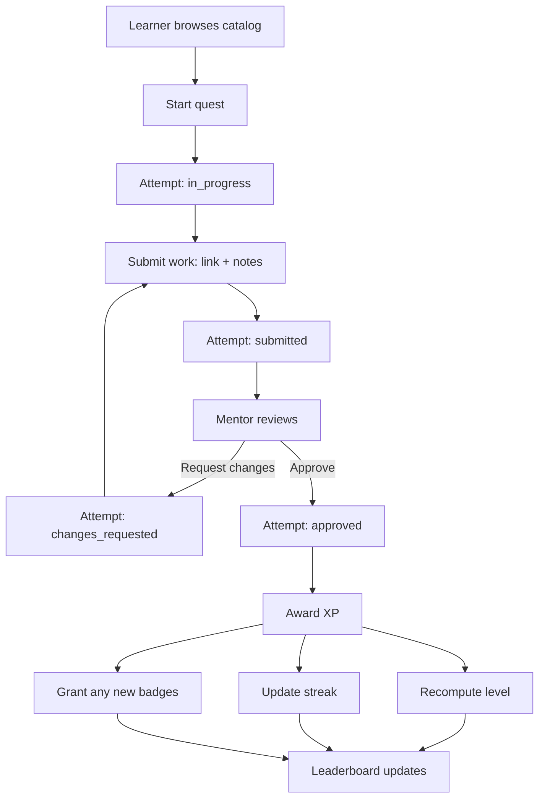
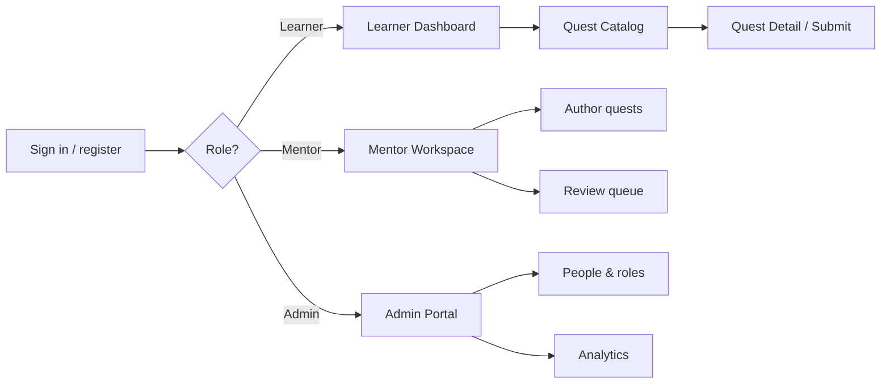

# LearnHub — Gamified Learning Platform

> Day 2: Product Thinking & Design Challenge — Activity 1 (Product Design Exercise)
> Problem statement: "Design a Gamified Learning Platform."

LearnHub is a gamified learning platform for tech upskilling, aimed at interns
and professionals building real engineering skills (JavaScript, React, Node.js,
Cloud, System Design, DevOps). Learners complete hands-on quests, submit their
work, and earn XP, levels, streaks, and badges once a mentor approves it.
Mentors author quests and review submissions. Admins manage people and watch
platform analytics.

This repository is a working full-stack MVP (MERN), not just slides. The
sections below are the design deliverables for the exercise (user roles, key
features, workflow diagram, wireframes, MVP definition); the rest of the README
explains how to run it.

- Backend: Node + Express (MVC layout), MongoDB via Mongoose, JWT auth, bcrypt
  password hashing, multer for profile-picture uploads.
- Frontend: Vite + React + Tailwind CSS, React Router, axios.

---

## The thinking behind it

**The problem.** Upskilling programs tend to fail in two ways: they're boring
(passive video courses with low completion) and disconnected from real work
(you finish a course but can't apply it). Engagement drops, and managers can't
tell whether skills actually improved.

**The idea.** Motivation and relevance are separate problems, and both need
solving. Game mechanics (XP, levels, streaks, leaderboards) address motivation.
Mentor-validated, build-something-real quests address relevance. Because a human
mentor signs off on each submission, the XP means something: you can't grind
fake points, so the leaderboard reflects real skill.

**Who it helps.**

- Learners get a clear progression loop and visible proof of growth.
- Mentors get a lightweight review queue instead of ad-hoc mentoring.
- Admins get analytics: who's active, which skills are growing, and where the
  review bottleneck is.

---

## 1. User roles

| Role | Who they are | What they can do |
| --- | --- | --- |
| Learner | Intern or professional upskilling (default role on sign-up) | Browse and filter the quest catalog, start a quest, submit work, earn XP/levels/streaks/badges, track progress, view the leaderboard, manage their profile |
| Mentor | Senior engineer or coach | Author quests (draft to publish), edit/unpublish/delete their quests, review the submission queue, approve (awards XP) or request changes with feedback |
| Admin | Program manager or platform owner | Everything a mentor can do, plus manage all people (change roles, activate/deactivate accounts), manage any quest, and view platform-wide analytics |

Permissions (enforced server-side):

| Capability | Learner | Mentor | Admin |
| --- | :---: | :---: | :---: |
| Register / manage own profile | Yes | Yes | Yes |
| Browse published quests | Yes | Yes | Yes |
| Start / submit quest attempts | Yes | No | No |
| Earn XP / badges / streaks | Yes | No | No |
| Author & manage own quests | No | Yes | Yes |
| Review submissions & award XP | No | Own quests | All |
| Manage users & roles | No | No | Yes |
| View platform analytics | No | No | Yes |

Guardrails: an admin can't change their own role or deactivate themselves, and
the system never lets the last admin be demoted or deleted.

---

## 2. Key features

**Gamification engine.** This is the core differentiator.

- XP and levels. XP is awarded only when a mentor approves a submission. Level
  is derived from total XP on a triangular curve (`xpForLevel(L) = 50·(L−1)·L`),
  so each level costs more than the last: L2=100, L3=300, L4=600, L5=1000 XP.
- Streaks. Consecutive-day activity is tracked (current and longest). Approving
  activity on consecutive days grows the streak; a gap resets it.
- Badges. Auto-granted milestones: First Steps (1 quest), Getting Serious
  (5 quests), Quest Machine (10 quests), Rising Star (level 5), On Fire (7-day
  streak), Track Master (3 quests in one track).
- Leaderboard. Learners ranked by XP, with the top 3 highlighted and your own
  rank pinned even when you're outside the visible list.

**Learning loop.**

- Quest catalog with track and difficulty filters; each card shows the XP reward
  and your attempt status.
- Quest detail with full instructions and a submission form (link to your work
  plus notes). One attempt per learner per quest.
- Mentor review queue: approve and award XP, or request changes with feedback
  (which sends the quest back to the learner for resubmission).

**Platform and accounts.**

- JWT auth (register and login), self-service profile editing, password change,
  account deletion.
- Admin analytics: users by role, quest counts, the submission funnel
  (in-progress, submitted, approved), total XP awarded, and completions by track.

---

## 3. Workflow diagram

Learner quest lifecycle (the core loop):



Role-based entry flow:



---

## 4. Wireframes

Low-fidelity layouts of the primary screens. These map one-to-one to the built
pages.

**Learner Dashboard**

```
+--------------------------------------------------------------+
| LearnHub      Dashboard   Quests   Leaderboard   Account     |
+--------------------------------------------------------------+
| Hi, Jane                                                     |
| 4-day streak  -  420 XP  -  3 quests done                    |
+---------------------------------+----------------------------+
| YOUR PROGRESS                   | LEADERBOARD     View all   |
| Level 3  [######----] 120/300   | 1. Asha        980 XP      |
| 420 XP   -   7-day best         | 2. You (Jane)  420 XP      |
|                                 | 3. Ravi        300 XP      |
+---------------------------------+----------------------------+
| BADGES (2 earned)                                            |
| [ First Steps ]   [ Getting Serious ]                        |
+--------------------------------------------------------------+
| CONTINUE LEARNING                            Browse all      |
| React: Build a Reusable Modal   React/Inter   In progress    |
+--------------------------------------------------------------+
```

**Quest Catalog**

```
+--------------------------------------------------------------+
|  Quest catalog                          [ Author a quest ]   |
|  [ All tracks v ]   [ All difficulties v ]                   |
+-----------------+-----------------+--------------------------+
|  JS / beginner  |  Cloud / beg.   |  SysDesign / advanced    |
|  Tame the Array |  Deploy to S3   |  Design a URL Shortener  |
|  map, filter,.. |  host static..  |  sketch the architecture |
|  +50 XP [Start] |  +50 XP [Start] |  +200 XP  [In progress]  |
+-----------------+-----------------+--------------------------+
```

**Quest Detail / Submission**

```
+--------------------------------------------------------------+
|  < Back to catalog                                           |
|  React / intermediate   -   +100 XP                          |
|  React: Build a Reusable Modal                               |
|  Create an accessible, controlled modal component.           |
+--------------------------------------------------------------+
|  INSTRUCTIONS                                                |
|  Build a Modal that closes on backdrop click and Escape...   |
+--------------------------------------------------------------+
|  SUBMIT YOUR WORK                            In progress     |
|  Link to your work:  [ https://github.com/...            ]   |
|  Notes:              [ explain your approach...          ]   |
|                                       [ Submit for review ]  |
+--------------------------------------------------------------+
```

**Mentor — Review Queue**

```
+--------------------------------------------------------------+
|  Mentor workspace          My quests  |  Review queue        |
+--------------------------------------------------------------+
|  Ravi submitted "Tame the Array"   JS / beg.   +50 XP        |
|  Link:  https://gist.github.com/...                          |
|  Notes: used reduce for the total...                         |
|  Feedback: [ nice work, clean solution                  ]    |
|                   [ Request changes ]  [ Approve & award ]   |
+--------------------------------------------------------------+
```

**Admin — Overview**

```
+--------------------------------------------------------------+
|  Admin portal              Overview  |  People               |
+--------------------------------------------------------------+
|  Learners 12   Mentors 3   Admins 1   Total XP 4,820         |
|  Quests 18   Published 14   Awaiting 5   Completed 47        |
+--------------------------------------------------------------+
|  COMPLETED QUESTS BY TRACK                                   |
|  JavaScript   ############   18                              |
|  React        #######         9                              |
|  Cloud        ####            6                              |
+--------------------------------------------------------------+
```

---

## 5. MVP definition

The MVP is the smallest product that proves the core hypothesis: that
mentor-validated, gamified quests drive engagement and visible skill growth.
Everything needed for that loop is built in this repo.

In scope (built):

- Email/password auth with three roles (learner, mentor, admin) and role-based
  routing and access control.
- Quest catalog with tracks, difficulties, and XP rewards; mentor authoring
  (draft, publish, edit, delete).
- Full attempt lifecycle: start, submit, mentor approve or request changes.
- Gamification engine: XP, derived levels, daily streaks, auto-awarded badges.
- Leaderboard ranked by XP.
- Admin analytics dashboard and people/role management.
- Profile management (edit, change password, delete account).

Out of scope (future work):

- Auto-graded quests (test runners or sandboxes). The MVP relies on human review.
- Teams/cohorts, seasonal challenges, and head-to-head competitions.
- Notifications (email or in-app), comments, and discussion threads.
- Skill trees, prerequisite paths, and certificates.
- SSO, payments, and granular org hierarchies.

Success metrics:

- Activation: share of new learners who complete at least one quest in week one.
- Engagement: weekly active learners, median streak length, started-to-submitted
  rate.
- Quality and throughput: submission-to-approval rate, mentor review turnaround.
- Growth: average XP and levels gained per learner per month.

---

## Project structure

```
.
├── backend/                # Express API (MVC)
│   ├── server.js           # entry point
│   └── src/
│       ├── app.js          # express app + middleware wiring
│       ├── config/         # db connection, badge catalog
│       ├── models/         # Mongoose schemas (User, Quest, Attempt)
│       ├── controllers/    # auth, user, quest, attempt, leaderboard, admin
│       ├── routes/         # route definitions
│       ├── middleware/     # auth (protect/allow), upload, error handling
│       └── utils/          # token, validators, gamification engine, seed
└── frontend/               # Vite React app
    └── src/
        ├── api/            # axios client
        ├── context/        # auth context
        ├── components/     # shared UI primitives, navbar, route guards
        └── pages/          # Login, Register, dashboards, catalog, leaderboard
```

## Prerequisites

- Node.js 18+
- MongoDB running locally (`mongodb://127.0.0.1:27017`) or a MongoDB Atlas
  connection string.

## Setup

### 1. Backend

```bash
cd backend
npm install
cp .env.example .env          # then edit values if needed
npm run seed                  # creates an admin + mentor + starter quests
npm run dev                   # starts on http://localhost:5000
```

Default seeded accounts (change in `.env`):

| Role | Email | Password |
| --- | --- | --- |
| Admin | `admin@example.com` | `admin123` |
| Mentor | `mentor@example.com` | `mentor123` |

Register your own learner account from the sign-up page to experience the full
XP loop.

#### Environment variables (`backend/.env`)

Copy `backend/.env.example` to `backend/.env` and fill in your values. The real
`.env` is gitignored and must never be committed.

| Variable | Description |
| --- | --- |
| `PORT` | Backend port (default `5000`) |
| `CLIENT_URL` | Frontend origin allowed by CORS |
| `MONGO_URI` | MongoDB connection string (local or Atlas) |
| `JWT_SECRET` | Secret used to sign JWTs |
| `JWT_EXPIRES_IN` | Token lifetime (e.g. `7d`) |
| `SEED_ADMIN_*` | Username/email/phone/password for the seeded admin |
| `SEED_MENTOR_*` | Username/email/phone/password for the seeded mentor |

### 2. Frontend

```bash
cd frontend
npm install
npm run dev                   # starts on http://localhost:5173
```

The Vite dev server proxies `/api` and `/uploads` to the backend on port 5000,
so no extra config is needed in development.

## API overview

| Method | Endpoint | Access | Purpose |
| --- | --- | --- | --- |
| POST | `/api/auth/register` | public | Register a learner (multipart for pic), returns JWT |
| POST | `/api/auth/login` | public | Log in, returns JWT |
| GET | `/api/users/me` | auth | Current user profile (+ XP/level/streak/badges) |
| PATCH | `/api/users/me` | auth | Edit own username/phone/picture |
| PATCH | `/api/users/me/password` | auth | Change own password |
| DELETE | `/api/users/me` | auth | Delete own account |
| GET | `/api/quests` | auth | List quests (`?track=&difficulty=&mine=`) |
| GET | `/api/quests/meta` | auth | Tracks, difficulties, default XP |
| GET | `/api/quests/:id` | auth | Quest detail (+ my attempt) |
| POST | `/api/quests` | mentor/admin | Create a quest |
| PATCH | `/api/quests/:id` | mentor/admin | Update a quest |
| PATCH | `/api/quests/:id/publish` | mentor/admin | Publish a quest |
| PATCH | `/api/quests/:id/unpublish` | mentor/admin | Unpublish a quest |
| DELETE | `/api/quests/:id` | mentor/admin | Delete a quest |
| POST | `/api/attempts` | learner | Start a quest |
| GET | `/api/attempts/mine` | learner | My attempts |
| PATCH | `/api/attempts/:id/submit` | learner | Submit work for review |
| GET | `/api/attempts/review-queue` | mentor/admin | Submissions awaiting review |
| PATCH | `/api/attempts/:id/review` | mentor/admin | Approve (award XP) or request changes |
| GET | `/api/leaderboard` | auth | Top learners by XP (+ my rank) |
| GET | `/api/admin/users` | admin | List users (`?role=`) |
| PATCH | `/api/admin/users/:id/role` | admin | Change a user's role |
| PATCH | `/api/admin/users/:id/activate` | admin | Activate a user |
| PATCH | `/api/admin/users/:id/deactivate` | admin | Deactivate a user |
| GET | `/api/admin/analytics` | admin | Platform-wide summary |
```